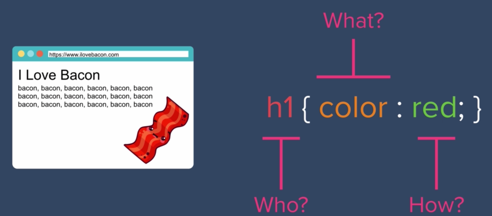

# The Anatomy of CSS Syntax

- CSS Syntax: the grammar of the CSS language
    - Think: English language has rules for when to capitalize letters, use commas and periods, etc.


- `selector` is the HTML element we want to style 
    - In an English, sentence, think of the selector as "who" we want to change
- `property` is a keyword defined in the CSS lnaguage
    - "What" do we want to change about the "who" / the element?
- `value` is the "How"? How do we want to change the property?
- *** Consider choosing a video character game and customizing it?
- Each line/rule has to end with a semi-colon





- Challenge: start with a bare-bones HTML file
    - Link an external style sheet (CSS file)
    - Change the text color of h1

- Best practice/way: alphabetize your properties for each selector you're styling

```
h1 {
    color: red;
    font-size: 200px;
}
```
- So if you ever want to add more styles or edit existing ones to a selector in the future, it will be easy to find selectors you already worked on