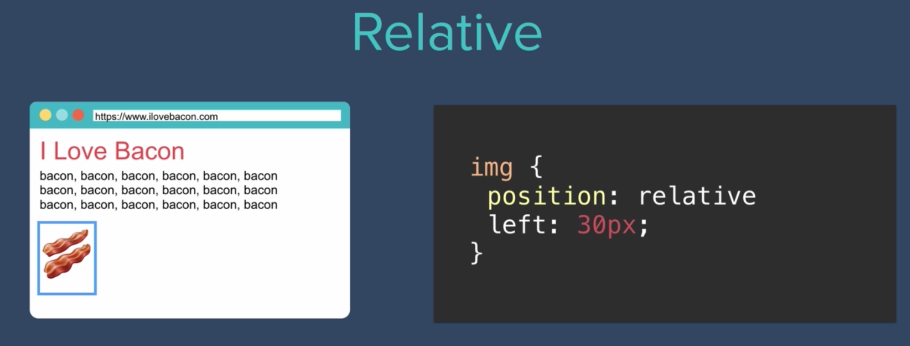
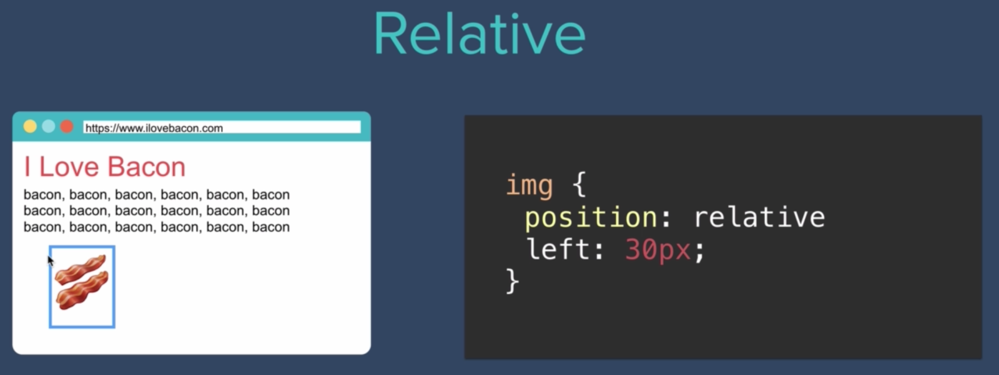
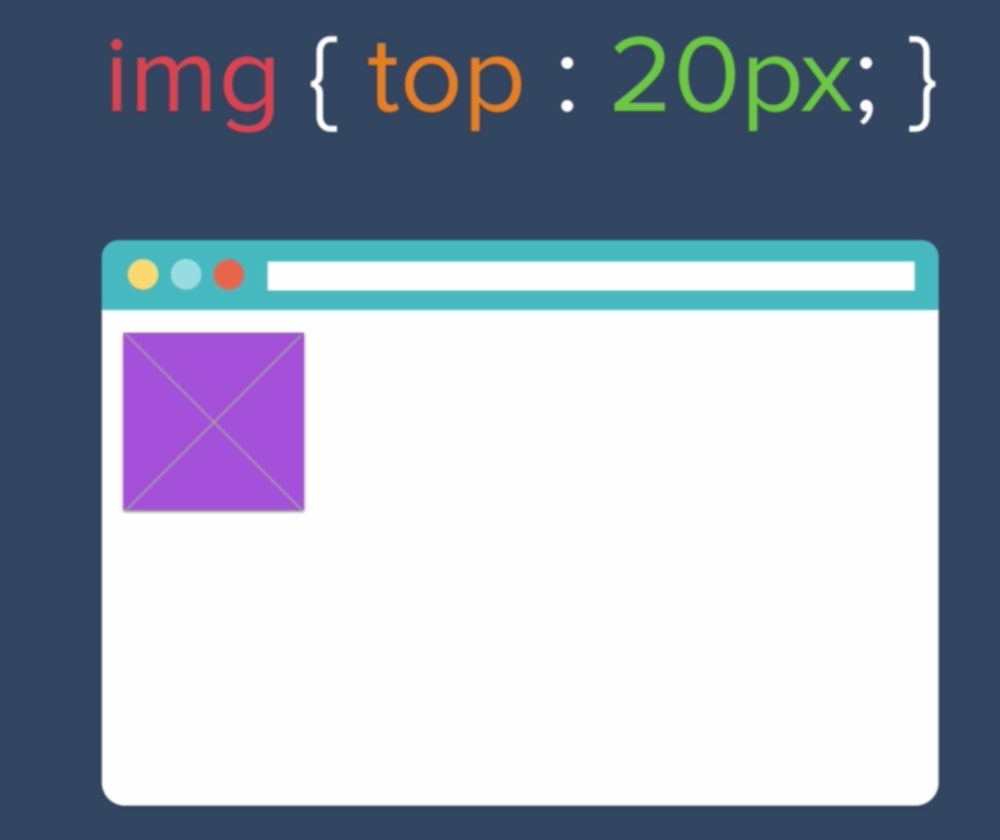
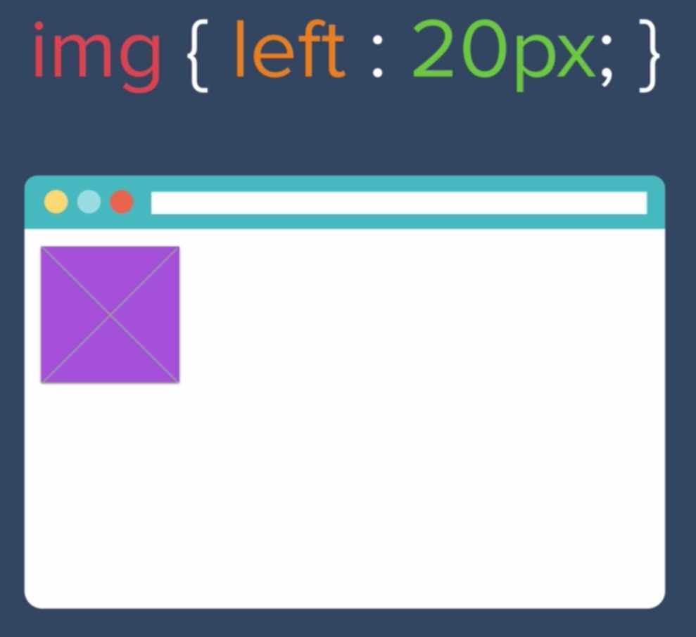
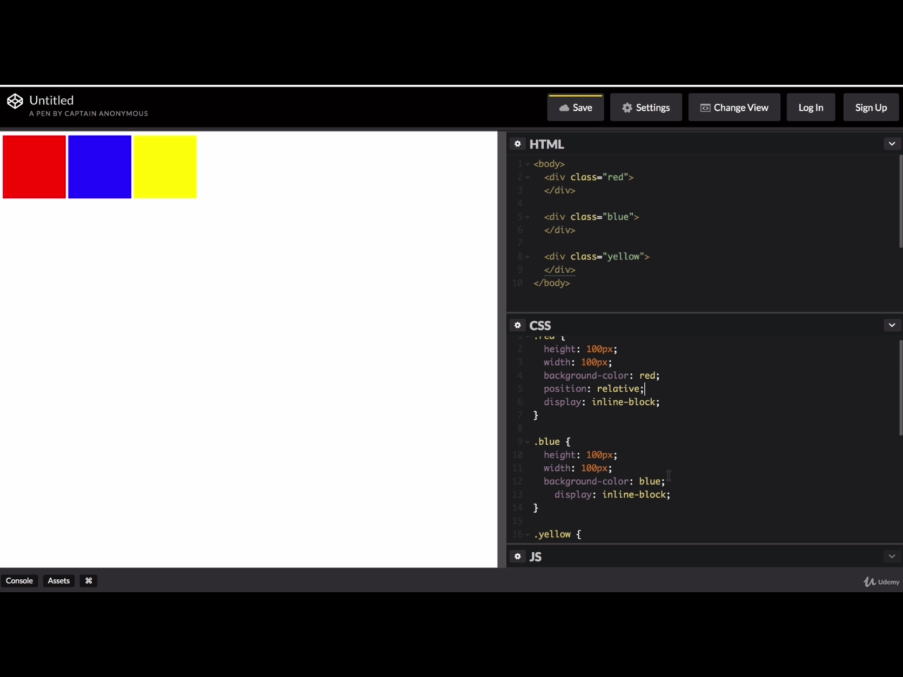
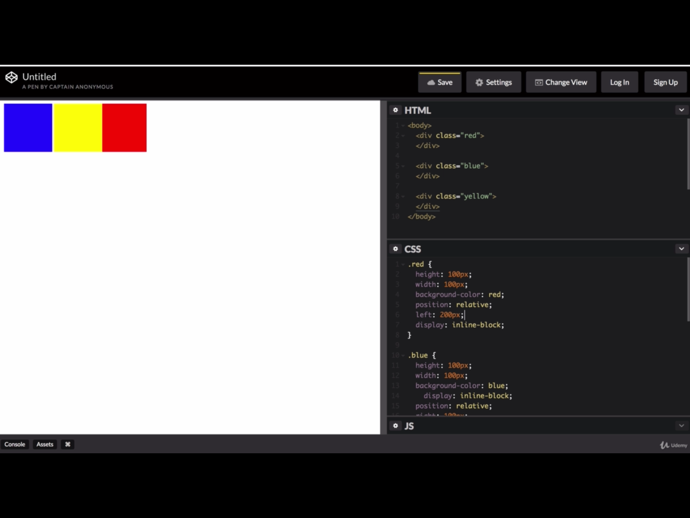

# CSS Static and Relative Positioning

- There are four positions we can use in CSS:

- All HTML elements are "static" in their position by default
- "static" just means go along with the HTML rules and keep with default HTML flow
    - What we see without any CSS we add

## Relative
- "relative" positioning needs to go with at least one of the following: left, right, top, bottom

- In the above images, we see the img element move 30px from the left, from where the left edge used to be
- There are four coordinates:

- We can, say, set an img element so the top edge is 20px is away from the top of where the img element used to be

- Can also change the left property:

- Challenge:

