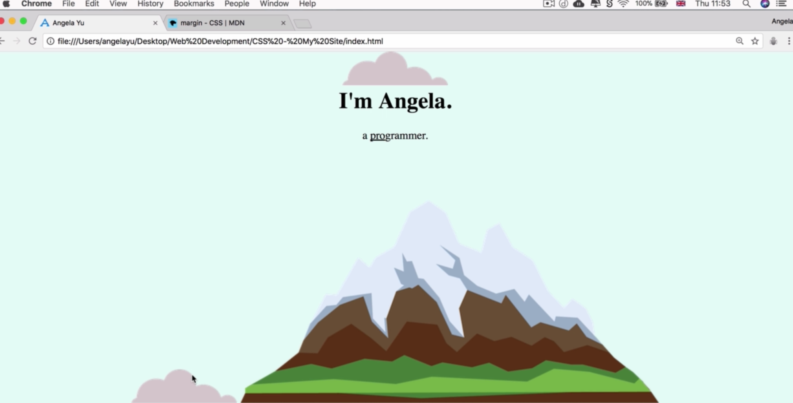
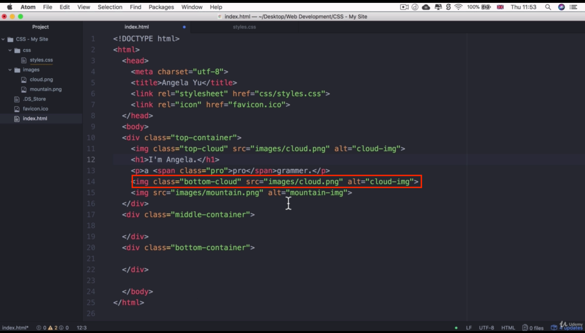
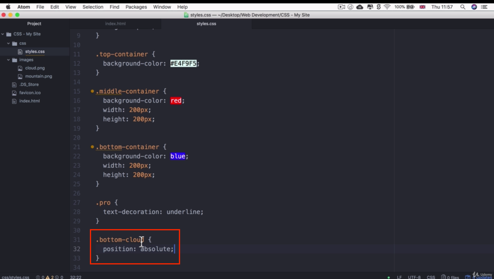
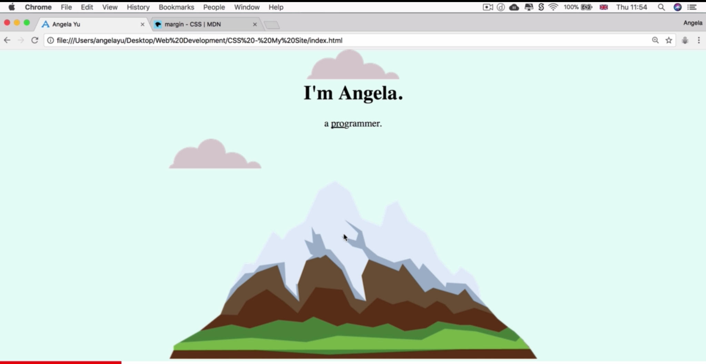
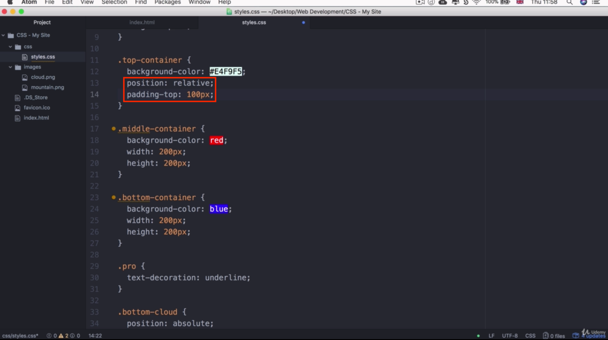
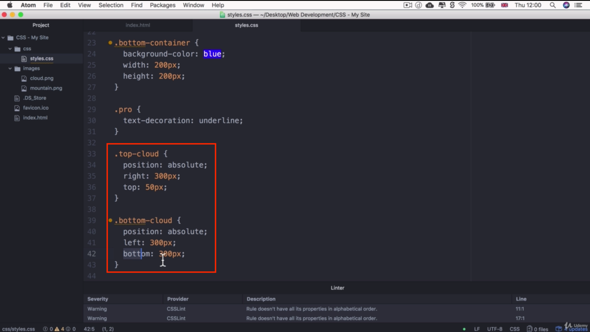
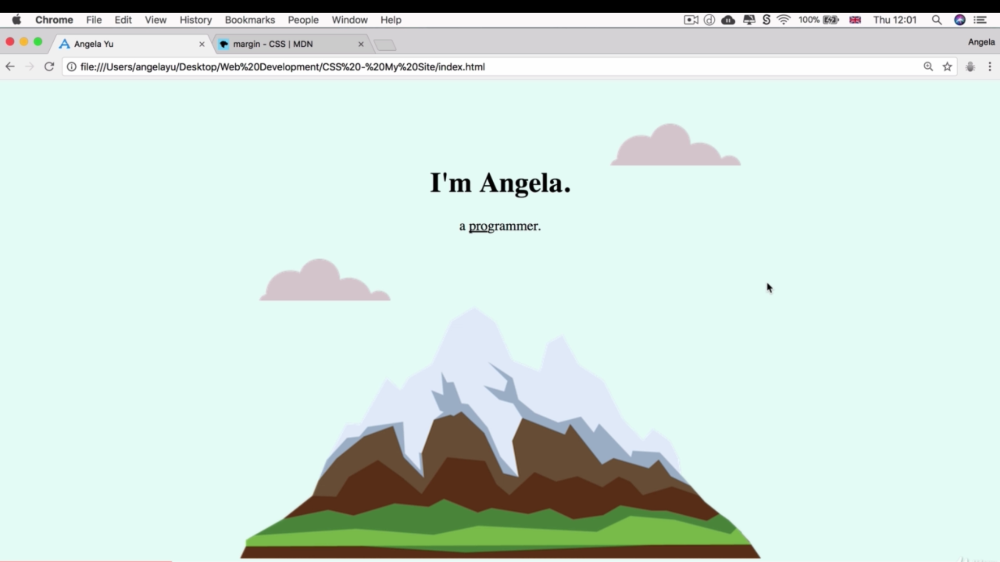

# Centering Elements with CSS

- Use `text-align: center` in the parent container, so that all children elements will be centered
    - Note that this will only work if we have inline-block elements (like images) and/or block elements that take up the entire width of the body
- Let's say we change h1's width to 10%:
```
body {
    margin: 0;
    text-align: center;
}
h1 {
    margin-top: 0;
    width: 10%
}
```
- Even though the body's text is centered, the h1 (a block element) no longer has a width that takes up the entire width of the body. So the h1 won't be centered
- So we can center block elements (with a different width) with the following:
```
h1 {
    margin: 0 auto; /* 0 auto 0 auto */
}
```
- Search MDN docs for margin shorthands


- Above, the two images (small cloud, and mountain) are next to each other (since they are inline-block elements)


- In HTML file, set a class of 'bottom-cloud' to the bottom cloud image

- In CSS file, set class of 'bottom-cloud' to have a position of 'absolute'


- Now, see that the mountain image is on its own line, and it's centered (because we used the text-align: center styling for all elements in the body)


- Remember, if we want to use absolute positioning for our elements, we want to set a position of relative to the parent container (so the container containing the elements we want to position absolutely) 
- Also, put some padding so top cloud is not so smashed up against the top of the screen


- 
