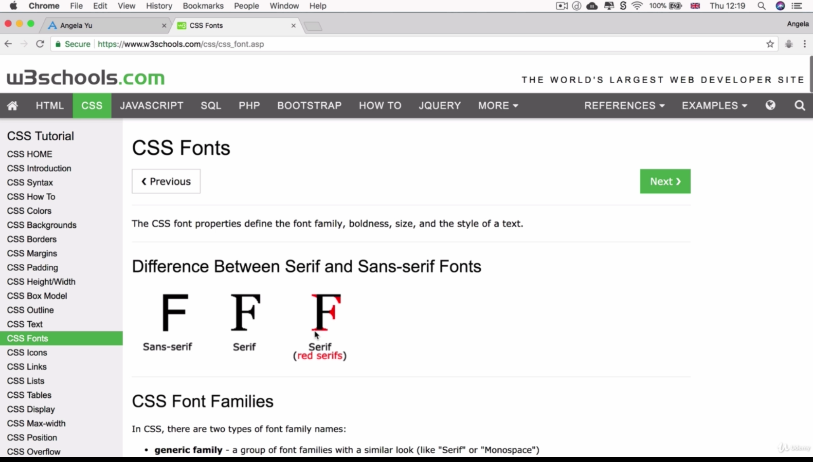

# Font Styling in Our Personal Site

- Difference between Sans-serif and Serif fonts



```
body {
    margin: 0;
    text-align: center;
    font-family: serif; /* either serif or sans-serif */
}
```
- If we go back to our webpage, you'll see that nothing changed, since by default, text on websites have the serif font-family
- Default serif font is "Times New Roman"

```
body {
    margin: 0;
    text-align: center;
    font-family: sans-serif; /* either serif or sans-serif */
}
```
- If we change the font-family to sans-serif (see above), we'll see that we no longer have the little feet on our letters on our webpage
- Default sans-serif font is "Arial"
- In addition to specifying sans-serif for the font-family, can also specify a _specific_ type of sans-serif font:
```
body {
    margin: 0;
    text-align: center;
    font-family: verdana, sans-serif;
}
```
- So first render the font to 'verdana'. If for some reason the browser or device doesn't have the verdana font, back up font that will display will be sans-serif (Arial)

- Use web safe fonts


- There are some fonts that are on Windows and some on Macs
- What can we do if we want to ensure that our fonts will always be displayed the way we want them?
    - Going from specific to not-specific
    - fonts.google.com
- On fonts.google.com:
    - After finding font you want, click on the plus symbol
    - Examples: Montserrat, Sacremento, Merriweather
    - Copy the embed link after getting all the desired fonts
    - Paste the embed link to the head of our HTML file
    - In the CSS file, paste the CSS rules from the Google fonts