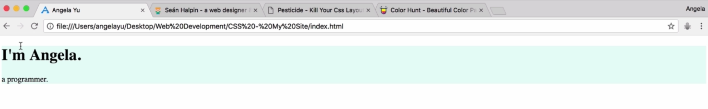

# HTML Divs
- Recreate the following h1 and paragraph:


```
<h1>I'm Grace.</h1>
<p>A computer science teacher.</p>
```
- Don't have to (since I'll have it installed), but get "Pestitcide" extension for Chrome
- Will put a box around each HTML element on our page
    - Notice that the h1 and p each have a box around it (on our page)
    - But Sean's h1 and p are grouped together, as if it's in one container or box
- Each HTML element is basically just a box
- `<div>` is a special element in HTML that allows us to group elements together
```
<div>
    <h1>I'm Grace.</h1>
    <p>A computer science teacher.</p>
</div>
```
- Note that div's don't do anything unless you use CSS with it
- Check to see we indeed have a div around our h1 and p using Pesticide extension
    - There's a div around the h1 and p elements
- "div" is from the word "content division element"
    - Allows us to split content into sections or containers
- Put a background-color for our div
- In HTML file:
```
<div>
    <h1>I'm Grace.</h1>
    <p>A computer science teacher.</p>
</di
```
- In CSS file:
```
div {
    background-color: #E4F9F5;
}
```



- Why doesn't the div touch the top, left, and right edges?
    - Well, remember that browser has default CSS. In other words, the browser inserts its own styles for a webpage. Like how a hr should look like or how an h1 looks like
- Can see default CSS using Chrome Dev Tools
    - See the default styles for h1 and div

```
body {
    margin: 0; /* all four sides will have a 0px margin */
}

h1 {
    margin-top: 0;
}

div {
    background-color: #E4F9F5;
}
```
- Now our div is touching all four sides
- Note that div's are only as tall as the content they hold
    - But you can set a specific height (and you can't see it unless you add a background-color)