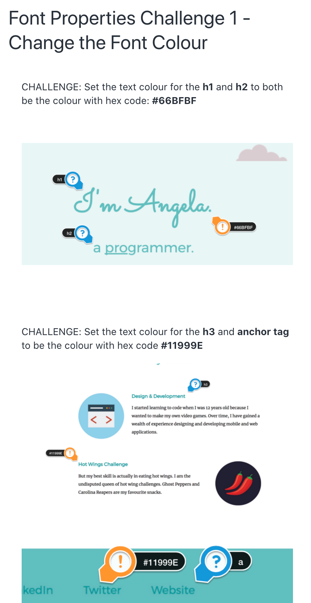

# Font Properties

## font-family

We can use CSS to change the size of our text. As you already know, our browser provides default styles, including sizes, for our tags. Notice that the h1 has the largest font size and `p` tags are smaller. But sometimes we want to change these sizes ourselves. 

We can do so with the CSS `font-size` property. 

If we want all the text on our page to be a little bit smaller, we can add a CSS rule for the `body`. But how do we measure font size? That's a great question, since there are at leat 10 different units of measurement for CSS font sizes. One of them is `px` (pixels). 

```
body {
    font-size: 11px;
}
```

All the text got smaller with a font size of 11px. Even the heading tags will get smaller. But the `h` tags  are still slightly larger than the rest of the text. That's because by default, `h1` tags are 2 times larger than, say, a `p` tag. `p` tags are 16 pixels by default.

So 11px on `p` tags means `h1` tags are 22px large (11 x 2). 

Another unit of measurement we can use is `em`.

```
h2 {
    font-size: 1.5em;
}
```
So 1.5em means 1.5 times more than the original font size for the `p` tag, which is 24 pixels.

## Example

- Let's say we want the fonts for an articl paragraph to be a different style from the paragraphs in the author section (put in `div`'s). We can use the `class` selector to apply a `"writer-bio"` class to these paragraphs we want styled differently

```

<h1>The Tech Corner</h1>

    <h2>Productivity Apps for School</h2>

    <p>Lorem ipsum dolor sit amet, consectetur adipiscing elit, sed do eiusmod tempor incididunt ut labore et dolore magna aliqua. Enim lobortis scelerisque fermentum dui. Mattis nunc sed blandit libero volutpat sed cras. Placerat in egestas erat imperdiet. Tortor at risus viverra adipiscing at in. Faucibus ornare suspendisse sed nisi lacus sed.</p>

    <div>
        <h3>Written by Grace Lee</h3>
        
        <p class="writer-bio">Computer Science Teacher at The Buckley School. Dedicated to helping young people explore the full potential of what they could learn and be through technology.</p>
    </div>

    <h3>My Time at the Tony Stark Internship</h3>
    
    <p>Sed nisi lacus sed viverra tellus in. Ornare aenean euismod elementum nisi quis eleifend quam adipiscing. Suspendisse faucibus interdum posuere lorem. Sagittis id consectetur purus ut faucibus pulvinar. Ut diam quam nulla porttitor. Malesuada fames ac turpis egestas sed tempus urna et pharetra. Tortor posuere ac ut consequat. Cursus euismod quis viverra nibh cras pulvinar. Ut tellus elementum sagittis vitae et leo. Nunc non blandit massa enim nec dui.</p>

    <div>
        <h3>Written by Peter Parker</h3>
        
        <p class="writer-bio">High school student, living in Queens, NYC. Science and tech enthusiast. The people who inspire me the most are Mr. Tony Stark and Spiderman.</p>
    </div>

```
- In the above code sample, we can have the same `class` name for the `p` tag within the div, in this case:  `writer-bio`. This will make the style for the `writer-bio` paragraph be different than the style from the other paragraphs that were used to write the actual article posts. So for the bio, we can have slightly smaller font size and a different color (light, gray?).

## Font Properties Challenge



- Also consider:
    - Use at least 2 different Google fonts
    - Set a font-size for the body (in em) and a font-size for the h1 - h3 (in rem)
    - Using Google, MDN, and/or W3 Schools, use: `letter-spacing`, `text-transform`, and `text-decoration` properties