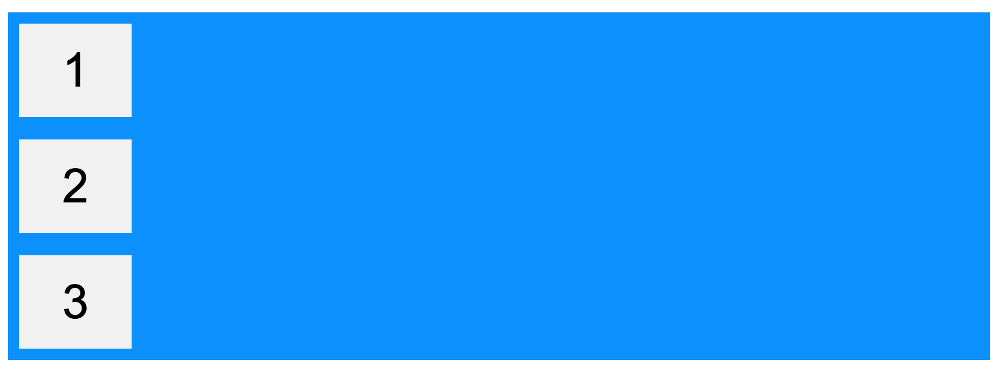
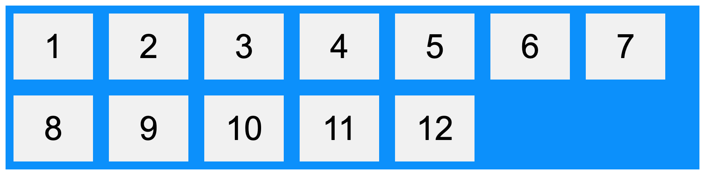
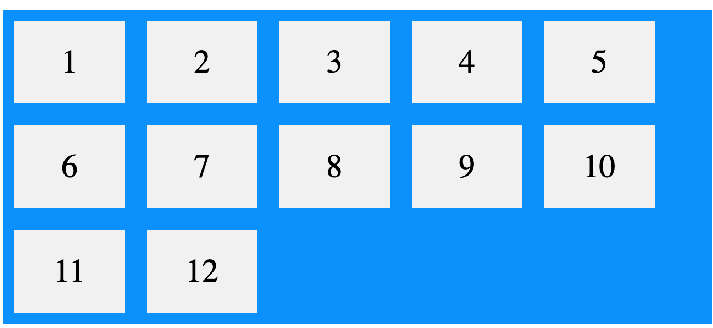
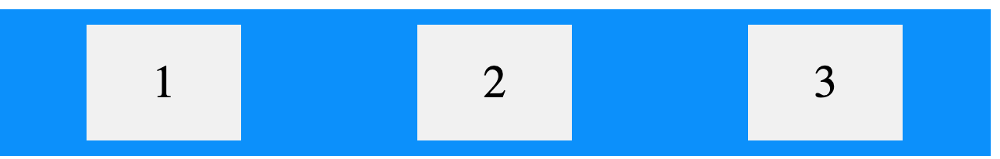
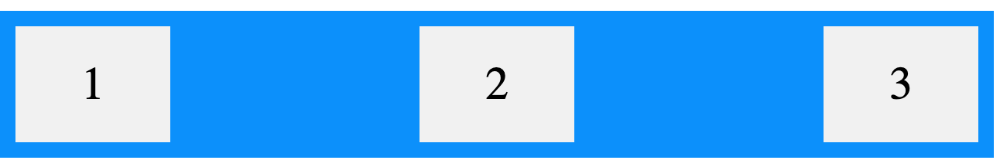

# CSS Flexbox Part 1

- The Flexible Box Layout Module, or flexbox, is a tool that makes it easier to design flexible responsive layouts

## Flexbox Elements
- To start using the Flexbox model, you need to first define a flex container.
- A flex container with three flex items:


- HTML file:
```
<div class="flex-container">
  <div>1</div>
  <div>2</div>
  <div>3</div>
</div>
```
- CSS file:
```
.flex-container {
  display: flex;
  background-color: DodgerBlue;
}

.flex-container > div {
  background-color: #f1f1f1;
  margin: 10px;
  padding: 20px;
  font-size: 30px;
}
```
## Parent Element (Container)
- The flex container becomes flexible by setting the display property to flex:
```
.flex-container {
  display: flex;
}
```
- There are flex container properties:
    * flex-direction
    * flex-wrap
    * flex-flow
    * justify-content
    * align-items
    * align-content

- These properties will define the direction, order, and number of rows and columns for our HTML elements

## flex-direction property
- The `flex-direction` property defines in which direction the container wants to stack the flex items.



- The "column" value stacks the flex items vertically (from top to bottom), which we normally do get with block elements in HTML:
- CSS file:
```
.flex-container {
  display: flex;
  flex-direction: column;
  background-color: DodgerBlue;
}

.flex-container > div {
  background-color: #f1f1f1;
  width: 100px;
  margin: 10px;
  text-align: center;
  line-height: 75px;
  font-size: 30px;
}
```
- We can also use the "column-reverse" value, which stacks the flex items vertically (but from bottom to top):
```
.flex-container {
  display: flex;
  flex-direction: column-reverse;
}
```
- The "row" value stacks the flex items horizontally (from left to right):


- CSS file:
```
.flex-container {
  display: flex;
  flex-direction: row;
  background-color: DodgerBlue;
}

.flex-container > div {
  background-color: #f1f1f1;
  width: 100px;
  margin: 10px;
  text-align: center;
  line-height: 75px;
  font-size: 30px;
}
```
## flex-wrap property
- The `flex-wrap` property specifies whether the flex items should wrap or not.
- The examples below have 12 flex items, to better demonstrate the flex-wrap property.


- HTML file:
```
<div class="flex-container">
  <div>1</div>
  <div>2</div>
  <div>3</div>  
  <div>4</div>
  <div>5</div>
  <div>6</div>  
  <div>7</div>
  <div>8</div>
  <div>9</div>  
  <div>10</div>
  <div>11</div>
  <div>12</div>  
</div>
```
- CSS file:
```
.flex-container {
  display: flex;
  flex-wrap: wrap;
  background-color: DodgerBlue;
}

.flex-container > div {
  background-color: #f1f1f1;
  width: 100px;
  margin: 10px;
  text-align: center;
  line-height: 75px;
  font-size: 30px;
}
```
- Notice that the last box on the right edge will be different based on how wide our screen is

## flex-flow property
- The `flex-flow` property is a shorthand/shortcut property for setting both the `flex-direction` and `flex-wrap` properties:



- HTML file:
```
<div class="flex-container">
  <div>1</div>
  <div>2</div>
  <div>3</div>  
  <div>4</div>
  <div>5</div>
  <div>6</div>  
  <div>7</div>
  <div>8</div>
  <div>9</div>  
  <div>10</div>
  <div>11</div>
  <div>12</div>  
</div>
```
- CSS file:
```
.flex-container {
  display: flex;
  flex-flow: row wrap;
  background-color: DodgerBlue;
}

.flex-container > div {
  background-color: #f1f1f1;
  width: 100px;
  margin: 10px;
  text-align: center;
  line-height: 75px;
  font-size: 30px;
}
```
## justify-content property
- The `justify-content` property is used to align the flex items (for items on a horizontal line)

- The "center" value aligns the flex items at the center of the container:


- HTML file:
```
<div class="flex-container">
  <div>1</div>
  <div>2</div>
  <div>3</div>  
</div>
```

- CSS file:
```
.flex-container {
  display: flex;
  justify-content: center;
  background-color: DodgerBlue;
}

.flex-container > div {
  background-color: #f1f1f1;
  width: 100px;
  margin: 10px;
  text-align: center;
  line-height: 75px;
  font-size: 30px;
}
```
- The "flex-end" value aligns the flex items at the end of the container:
```
.flex-container {
  display: flex;
  justify-content: flex-end;
}
```
- The "space-around" value displays the flex items with space before, between, and after the lines:


- HTML file:
```
<div class="flex-container">
  <div>1</div>
  <div>2</div>
  <div>3</div>  
</div>
```
- CSS file: 
```
.flex-container {
  display: flex;
  justify-content: space-around;
  background-color: DodgerBlue;
}

.flex-container > div {
  background-color: #f1f1f1;
  width: 100px;
  margin: 10px;
  text-align: center;
  line-height: 75px;
  font-size: 30px;
}
```
- The "space-between" value displays the flex items with space between the lines:


- HTML file:
```
<div class="flex-container">
  <div>1</div>
  <div>2</div>
  <div>3</div>  
</div>
```
- CSS file:
```
.flex-container {
  display: flex;
  justify-content: space-between;
  background-color: DodgerBlue;
}

.flex-container > div {
  background-color: #f1f1f1;
  width: 100px;
  margin: 10px;
  text-align: center;
  line-height: 75px;
  font-size: 30px;
}
```
- In short, "space-between" exludes the edges and "space-around" includes the edges

## align-items property
- The "align-items" property is used to align the flex items (that are on a veritcal line. So you would use the "row" value for the "flex-direction" property on the parent container that is holding all the children, or flex items) 
- So remember that `justify-content` is for items layed out on a horizontal line
- Like `justify-content`, can use the following values:
  * flex-start
  * flex-end
  * center
  * space-between (excluding edges)
  * space-around (including edges)

  ## Child Elements (items)
- The direct child elements of a flex container automatically becomes flexible (flex) items.
- The flex item properties are:
  * order
  * flex-grow
  * flex-shrink
  * flex-basis
  * flex
  * align-self