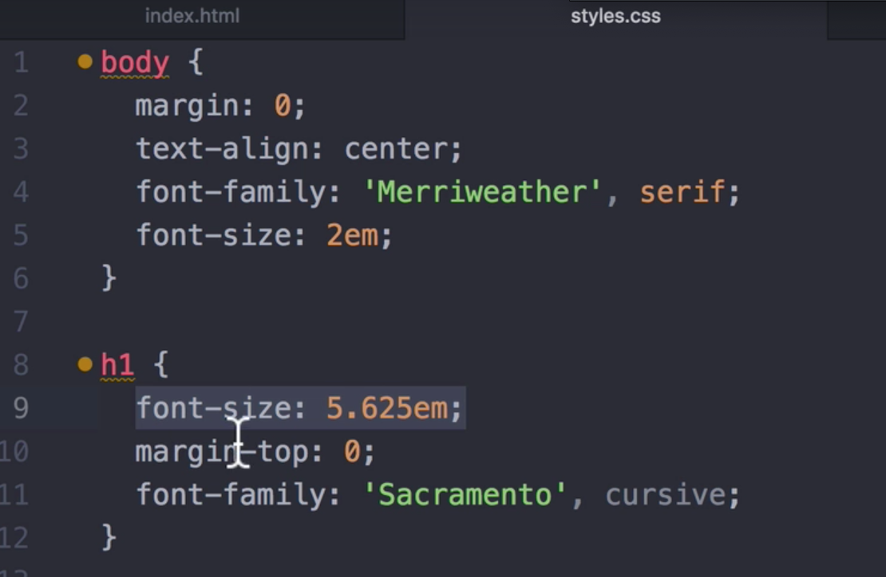
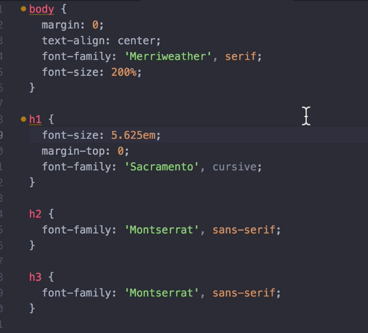
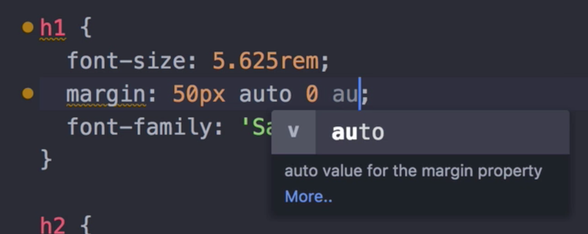

# CSS Sizing

- Let's say we want to change the font size of an h1
```
h1 {
    font-size: 90px; /* this is like changing our font size on Google Docs to 90px*/
}
```
- Make sure you're not zoomed in or zoomed out when seeing your styles on your webpage. That way, you'll see what others will see as well
- But if we shrink our browser, or see our site on different devices (see Chrome Dev tools for different devices), the size of the font is _not_ dynamic – it remains 90px. But we probably don't want a huge font on smaller screen sizes, like a phone
- Notice that if we go to site like techcrunch.com, and if we shrink our page, the text will also shrink or scale down
- We can use `em` to assign our font-sizes
    - Now, we've seen em used in HTML, used to italicize words. But this em is completely different when you're assigning a font-size
- `1em = 16px`
- View the website comfortably, even for those who have visual impairments, vision issues (some people will set their browser settings so that font sizes are larger than usual)


- Be careful when you have a font-size for the body
    - Your h1 will be massive since font-sizes will carry over from parent elements, if they were assigned a font-size using em. But font-size in pixels don't get inherited from parent elements
- In the above case, the h1 has a 2em x 5.625em font size


- Above, we assigned a 200% (or 32px or 2em) font-size for the body. But our h1 has a 5.256em font-size. Our h1 is huge now
- If we forgot we had a body font-size, then this would be hard to fix
- Use `rem` if not working on styling for the body

```
h1 {
    font-size: 5.625rem;
}
```
- rem is relative em. So it will ignore any parent font-sizes that have used em. And using rem will always calculate like so: the number in front of rem x 16px, which in this case would be 90px for the h1



- Above, if we just leave margin-top to be 0, we still have a huge gap between the h1 and h2
- Change margin-top to margin
    - Use circle shorthand. Notice that we use auto for left and right margins, so the text will remain centered
    - The 0 is for the bottom margin, so there is no margin or space between the bottom of the h1 and the top of the h2