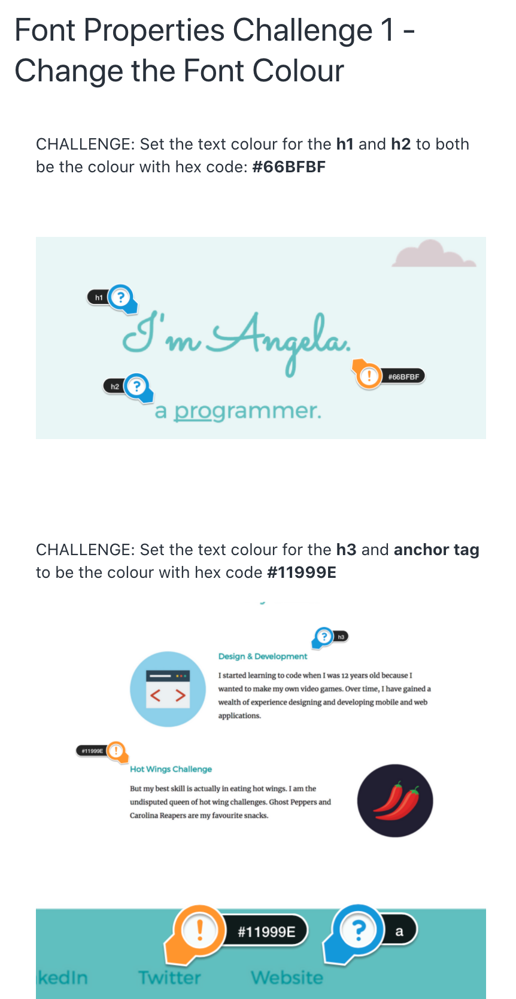

# Font Properties Challenge

- Also consider:
    - Use at least 2 different Google fonts
    - Set a font-size for the body (in em) and a font-size for the h1 - h3 (in rem)
    - Using Google, MDN, and/or W3 Schools, use: `letter-spacing`, `text-transform`, and `text-decoration` properties