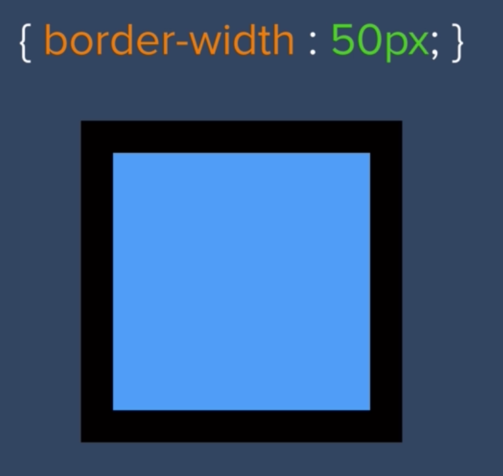

# The Box Model of Website Styling

- We've seen that every single HTML element we've seen on a screen is really just a box
- And we can change the style of each box
    - Its height, width, background-color, color (if the element is text), etc.
- Expand the image to fill up 100% of the width of our screen (a.k.a the view port). Could be the screen of iPad, Chromebook, phone, etc.


- This idea of being able to change the width and height of HTML elements is called the box model idea, or just the box model


- Border will create a default 3px border





- Our text in a div might seem too close to the edges of our div
    - Set padding:
    ```
    div {
        padding: 20px;
    }
    ```
    - 20px of space between the text and edge of the element
- Use `margin` to set space between each _element_
```
div {
    margin: 10px;
}
```
- Use Chrome Dev tools to see the box model for each element
    - Can also uncheck existing styles (see checkboxes), AND add your own styles to experiment with how your site will look like


## Challenges

