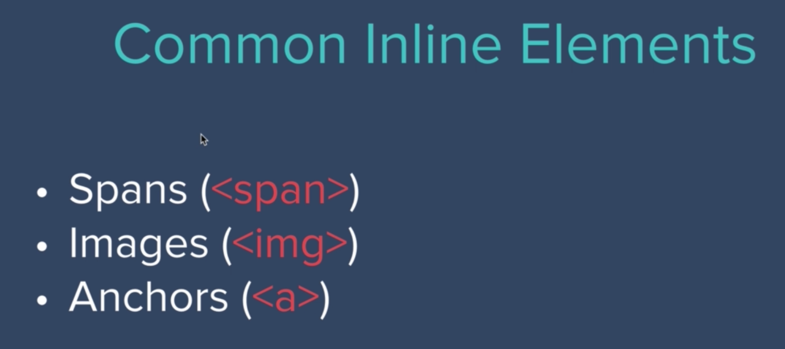

# CSS Display Property

- Let's say we have the following in this order: h1, img, p, img, img
    - We'll notice that the img after the h1 takes up its own line (not next to h1 or p), and the two img tags after thr p are next to each other
    - Why is that?
- See the `display` property for all HTML elements


- Turn on Pesticide extension
    - Notice that the box around the cloud are only as wide as the image's width
    - But the boxes around the h1 and p are as wide as the width of the page
- By the default, some elements have a display of "block"
    - "Block elements" take up the entire width of the screen 
    - Thus, blocking out other elements. So no elements can be placed on the left or right of a block element


- Paragraph will take up whole width of the screen


- How might we style just a certain part of a word? How can we just style the "pro" in the word "programmer" in a paragraph?

- In HTML file:
```
<p>I'm a <span class="pro">pro</span>grammer</p>
```

- In CSS file:
```
.pro {
    text-decoration: underline;
}
```
- So `<span>`can be used to select, or highlight, certain parts of text
- A span is known as an "inline display element", which is large as the content inside of it
- Turn on Pesticide, and you'll see that the "pro" has its own box. And if it's next to other inline display elements, it will be on the same line as the other inline display elements



- So links will be right next to each other. So if you want to separate links so that each one is on its own line, you will need to use the `<br>` tag
- Can have spans as stand alones (not just in paragraphs)


- You _cannot_ change the width of spans. But you can change the width of block elements


- Use the `inline-block` value for display. This will allow us to have an inline element _and_ we can change its width:


- So you can think of img elements as inline-blocks, since width (and height) of img elements can be changed. And they can be on the same line as other inline elements