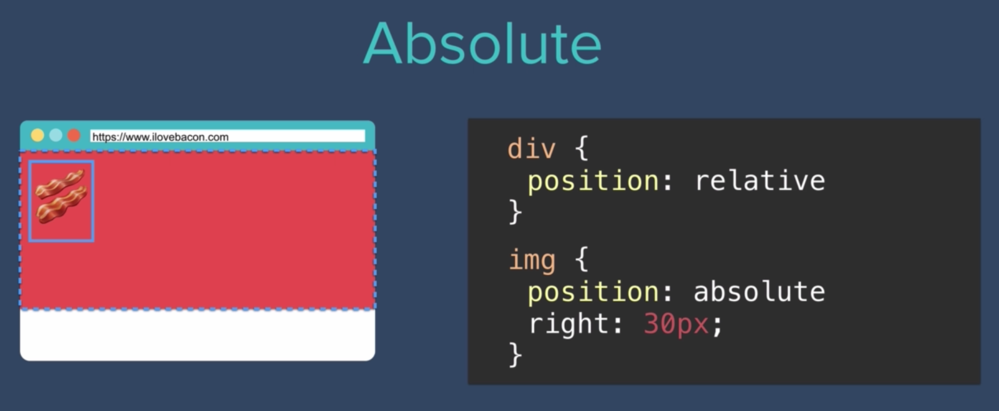
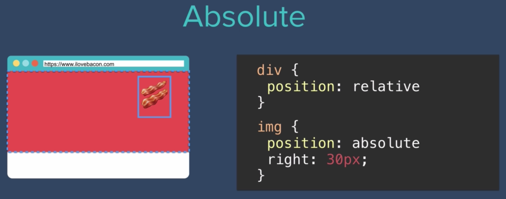

# Absolute & Fixed Positioning

## Absolute

- Let's say we have an image inside of a div
- Image would be shifted to the right (and notice that it's 30px from the right of the div)
- So elements with a position of "absolute" change position based on the parent element




## Fixed

- The 'fixed' position makes elements stay 'fixed', or stay in place, even if we scroll through the page
- This is useful if we want a navigation bar to stay put even if users scroll up or down the page

```
.navbar {
    position: fixed;
}
```