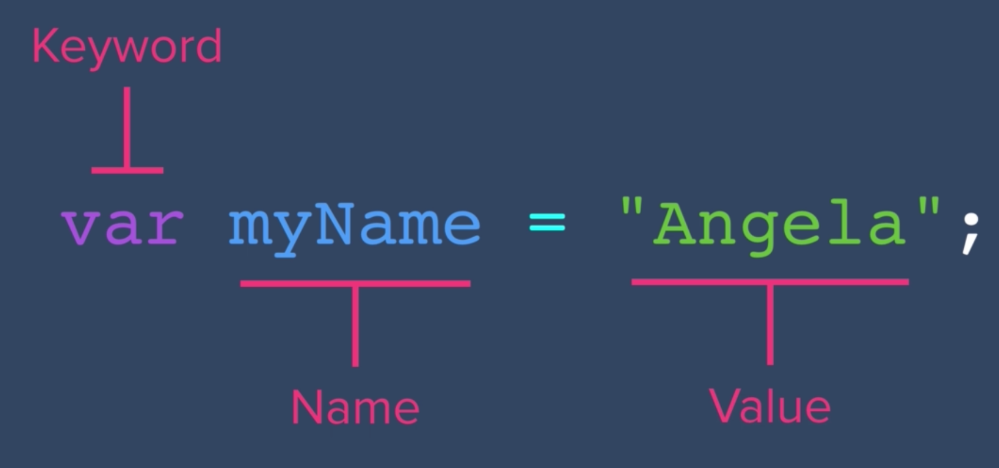
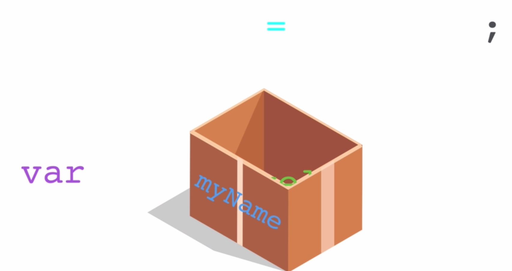

# JavaScript Variables

- Scenario: My name is Ms. Lee, and I'm a computer science teacher at Buckley.
    - I probably don't have to tell you over and over again that information
- In JavaScript, we have variables
- Just like how you committed my name and some information about me to your memory, we can commit memory, or data, to our computer
- In Chrome console:
```
prompt("What is your name?");
```
- Although we prompted users for a name, that information is lost. We didn't commit it to the computer's memory
- In console:
```
let myName = "Grace";
```
- If we then used `console.log(myName)`, we'll get "Grace"
- We saved "Grace", data, in a variable



- Just like how `alert` and `prompt` are keywords, `let` is a keyword
- The word after the `let` keyword is whatever name we want to give our variable


- Can think of 'let' as the container or a box
- myName is the label or name of the box
- The value is what goes inside the box
- If I wanted to, I can change (or re-assign) the value of the variable
```
myName = "Jane";
```
- Notice we're not using the `let` keyword again
    - Just use `let` when you're making a new variable
    - If you want to use the variable or reassign its value, don't use the `let` keyword in front of the variable name
- Challenge: using myName, create an alert. But don't put a string in the alert's message:
```
let myName = "Grace";
alert(myName);
```
- Can also keep values from prompts:
```
let yourName = prompt("What is your name?");
alert("Thanks for stopping by, " + yourName + "!");
```