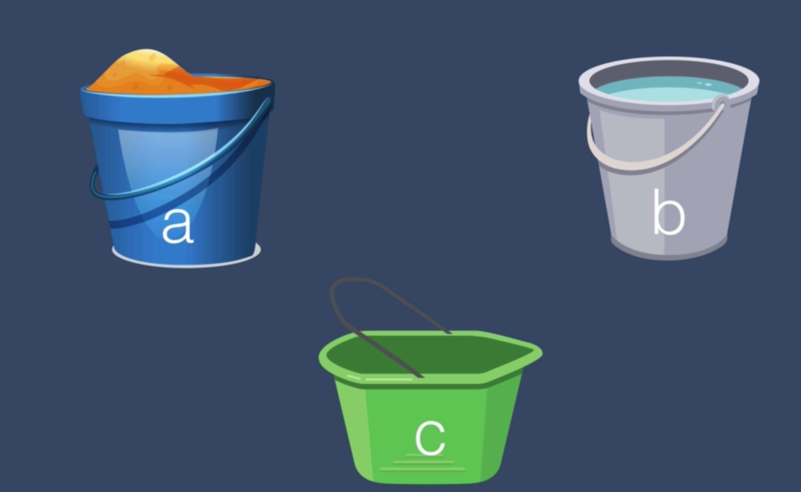
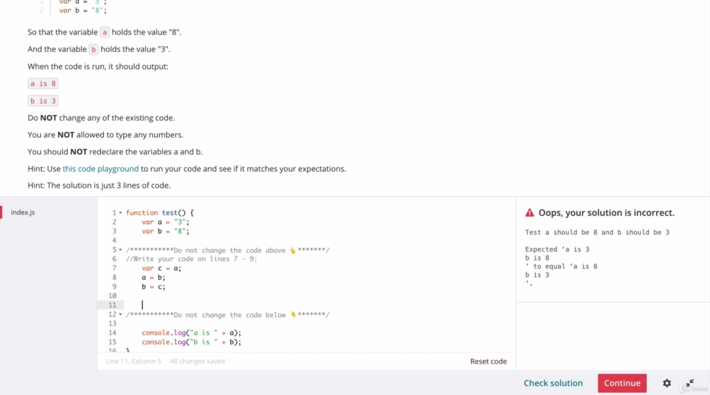

# JS Variables Exercise + Solution

- Think of this problem in terms of a real life situation where you have a bucket with sand and another bucket with water
- Say you can use a third bucket to switch the contents of bucket a and bucket b around

