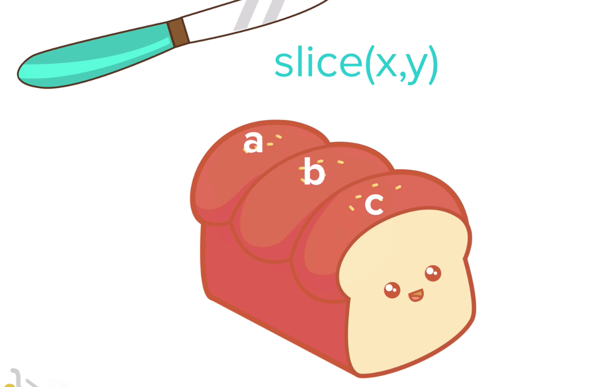
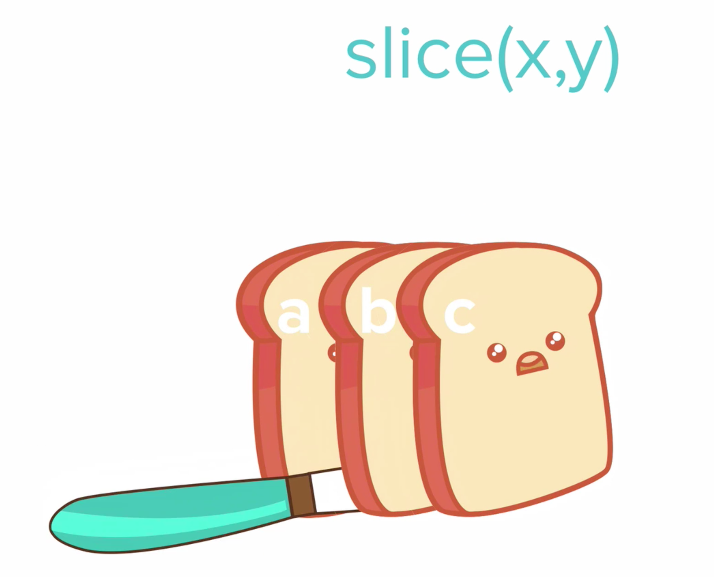
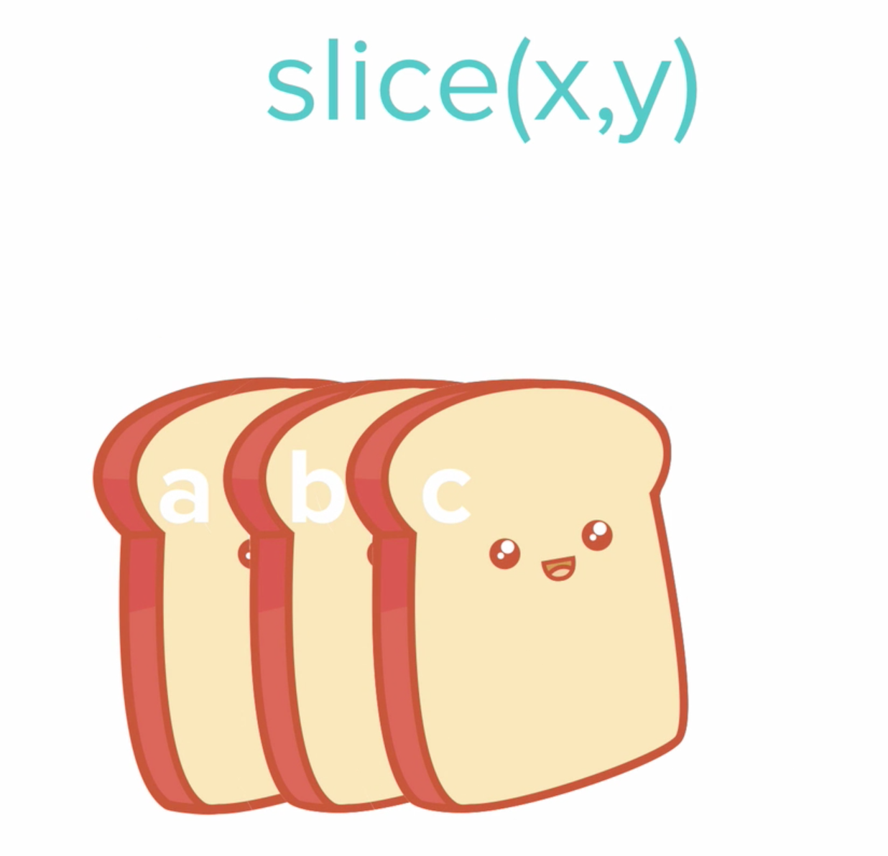
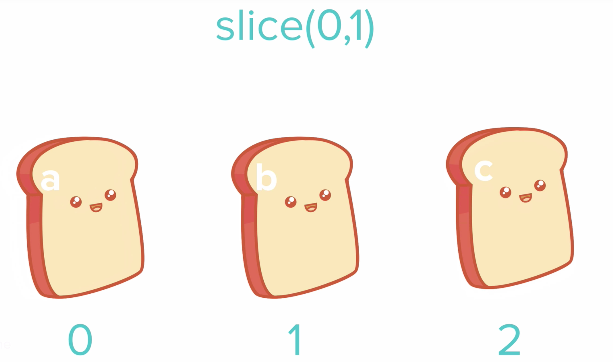

# Slicing and Extracting Parts of a String

- Going back to our Twitter example...
- Instead of showing negative number of characters, it would be nice to make it so users can't type any more characters after the limit is reached
 - twitter-character-counter.com
    - If we input a sample paragraph in the counter, we see that characters are cut off at the end
- we can use the slice method to replicate this feature



```
let myName = "Grace";
console.log(myName.slice(0, 1));

// will return "race"
```
- In the above code, we are starting at index 0
- So in the slice method, it takes 2 parameters: (1) starting index (inclusive) (2) ending index (exlusive)
- *** Very important to remember that programmers count starting with 0
- Remove the last character:
```
let myName = "Grace";
console.log(myName.slice(4, 5));

// will return "e"
```




- Challenge: using what we know, refactor the Twitter functionality so that users can't type more than 140 characters when tweeting

```
let tweet = prompt("Write your tweet:");

let tweeetUnder140 = tweet.slice(0, 140);

alert(tweetUnder140);
```

- Can also refactor the above code like so:
```
alert(prompt("Write your tweet:").slice(0, 140));
```
- _But_ it's good practice / a good idea to store values in variables, in case you ever want to go back to your code and change values (especially helpful if you end up with a lot of lines of code)