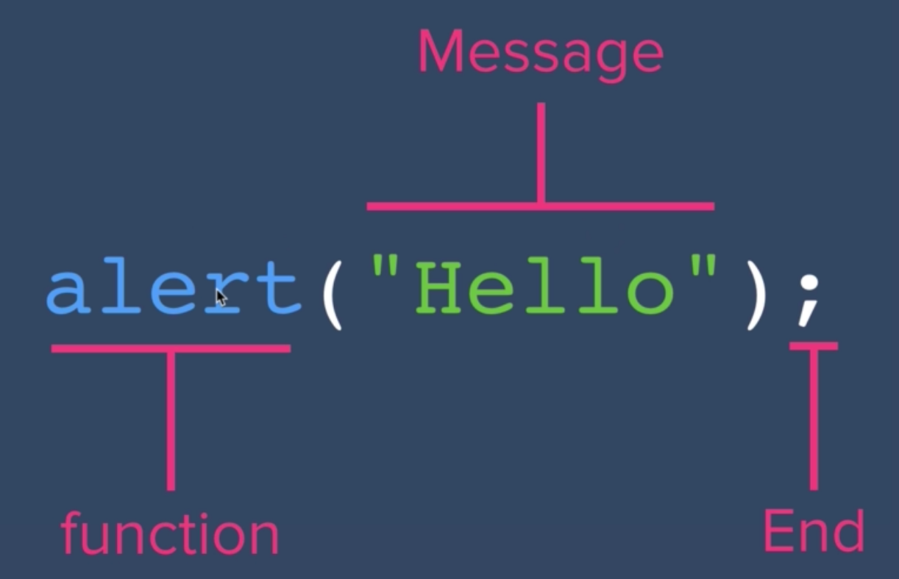

# JavaScript Alerts - Adding Behavior to Websites

- Open up a new Chrome tab and open up Chrome Dev Tools to get to the console
- The console allows us to write JavaScript code

```
alert("Hello world!");
```
- Will bring up a pop-up with the text
- To write multi-line code, hit "shift" and "enter" at the same time. Then we can write the following code in the console:

```
alert("Hello");
alert("World!");
```
- The browser knows we're trying to create a pop-up
- But can also use repl.it to test out code
    - Make sure to use the HTML, CSS, and JavaScript template (NOT just the JavaScript one!)
```
say("Hello world!")
```
- The above code will give us an error
- Browser is saying that it doesn't recognize "say" as a keyword
- How do we know that alert is a built-in function / keyword? Use the docs
- We can't just make up keywords



- A function is a command that will get our browser to do something
- Semi-colon ends the end of a sentence, or instruction
- Just like how we have punctuation and grammar rules in the English language, we need these parentheses, colons, quotation marks, and other symbols to use the JavaScript language
- Browser doesn't care if you use single or double quotes
    - But as a convention, most JavaScript programmers will use double quotes