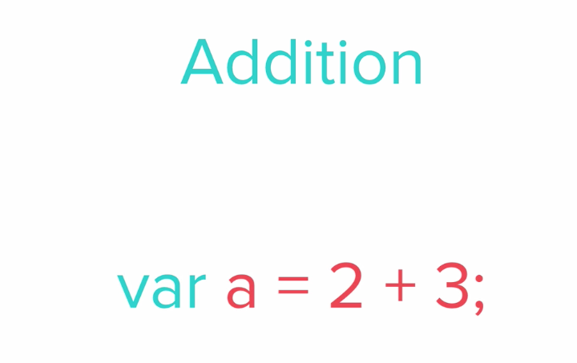
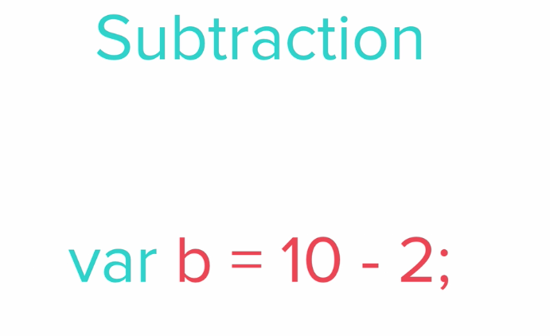
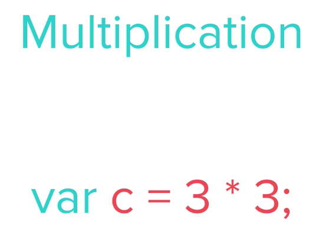
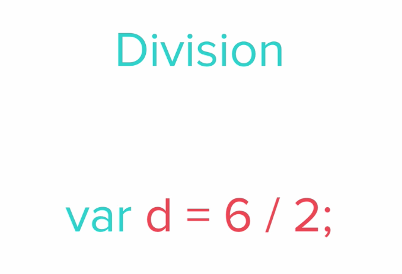
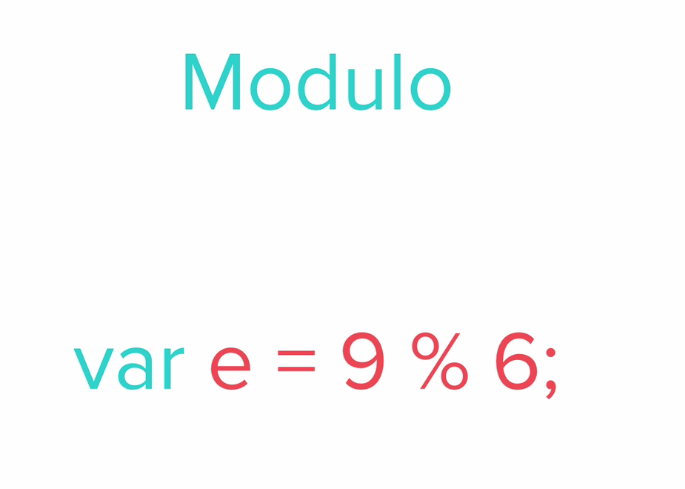
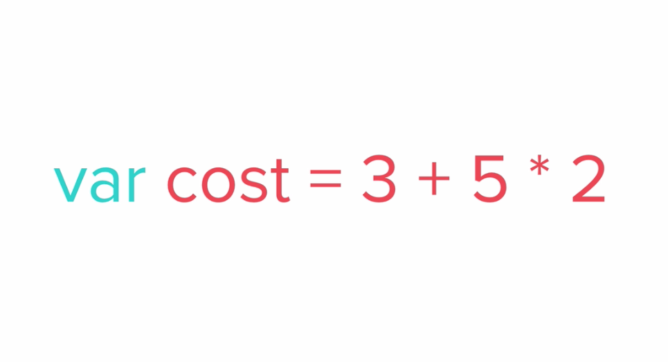
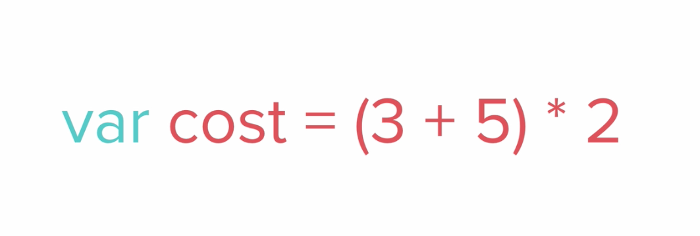
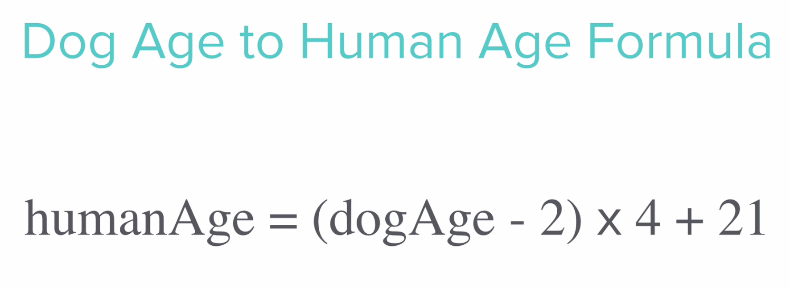

# Basic Arithmetic and the Modulo Operator in JS

- Working with numbers in JS is pretty straightforward






- But there is one mathematical operation that isn't so intuitive / obvious: the modulo operator


- Above, it looks like we're trying to divide 9 by 6
- But we actually get the _remainder_ of the division
- Since 6 goes into 9 only one time, you get a remainder of 3
- So `6 % 4` is 2
- And `12 % 8` is 4
- Why would we use the modulo operator though?
    - Say we do `45 % 2`. Then we'll get 1. So we can use `x % 2` to see if a number is even or odd


- Above, we'll get 13. Just like how we use PEMDAS in math, the same applies to JavaScript. So JS will multiply before adding here


- It's good practice to use parentheses, even if you know which operations will happen first

- Challenge: using prompt command, ask users for the age of their dog
    - Use their response to calculate the 'human age' of their dog
    - Use alert command to return the 'human age' of the dog



```
let dogAge = prompt("Let's see how old your dog would be in human years! How old is your pup?");

let humanAge = (dogAge - 2) * 4 + 21;

alert("Your dog would be " + humanAge + " years old in human years!");
```