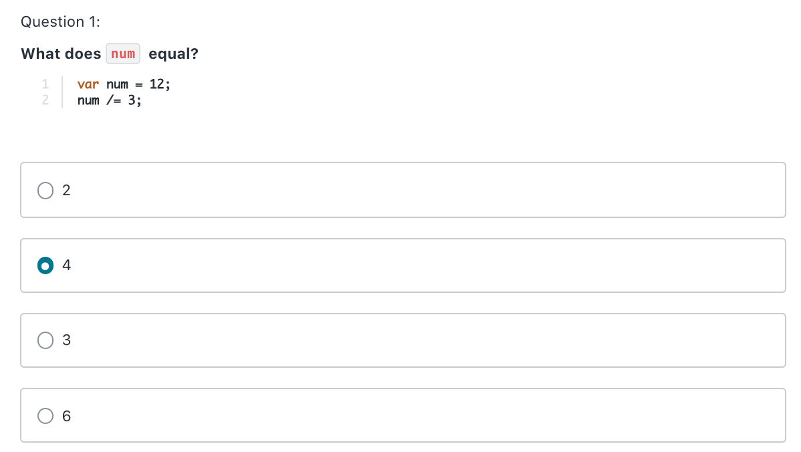

# Increment and Decrement Expressions + Quiz

- Can reassign variables AND use the previous value when doing thisi reassingment:
```
let x = 5;
x = x + 1; // 6
```
- Instead of adding 1 to the variable that holds the previous value we gave it, we can do the following:
```
let x = 5;
x++; // same thing as x = x + 1
```
- The above (++) is called incrementing
- Can also do --:
```
let x = 5;
x--; // same thing as x = x - 1
```
- The above (--) is called decrementing
- We can only use ++ or -- to add or subtract 1
- But we can increment or decrement by more than 1:
```
let x = 5;
x += 2; // same thing as x = x + 2, so we get 7
```
- Can increment or decrement with variables:
```
let x = 5;
let y = 3;
x += y; // 8
```
- Other mathematical operators we can use:
```
+=
-=
*=
/=
```
## Quiz




