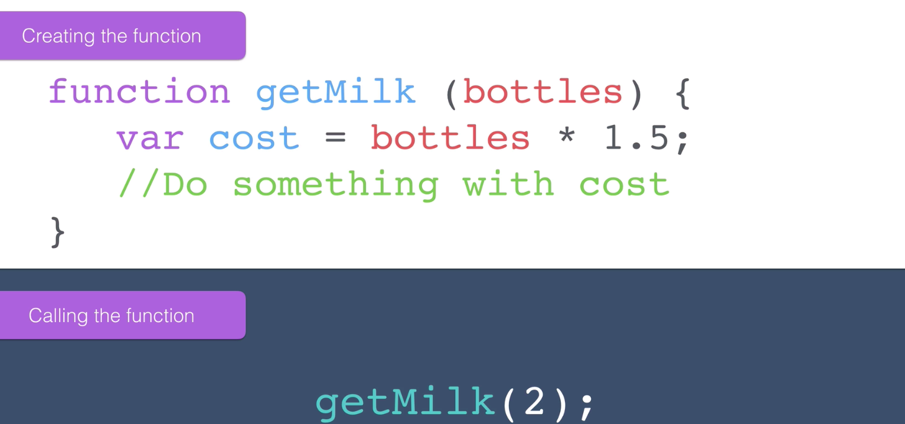

# Functions Part 2 - Parameters and Arguments

- We can accept an input when creating functions:

- The parameter, `bottles` can be named whatever we like (following variable naming conventions/rules)

- Consider the function below:
```
function getMilk() {   
  console.log("leaveHouse");
  console.log("moveRight");
  console.log("moveRight");
  console.log("moveUp");
  console.log("moveUp");
  console.log("moveUp");
  console.log("moveUp");
  console.log("moveRight");
  console.log("moveRight");
  console.log("moveLeft");
  console.log("moveLeft");
  console.log("moveDown");
  console.log("moveDown");
  console.log("moveDown");
  console.log("moveDown");
  console.log("moveLeft");
  console.log("moveLeft");
  console.log("enterHouse");
}
```
- Let's refactor the code:
```
function getMilk(bottles) {   
  console.log("leaveHouse");
  console.log("moveRight");
  console.log("moveRight");
  console.log("moveUp");
  console.log("buy " + bottles + "bottles of milk");
  console.log("moveDown");
  console.log("moveLeft");
  console.log("moveLeft");
  console.log("enterHouse");
}

getMilk(12);
getMilk(4);
```
- So in the above code, we can get our robot to buy 12 bottles of milk one day and 4 bottles of milk the next