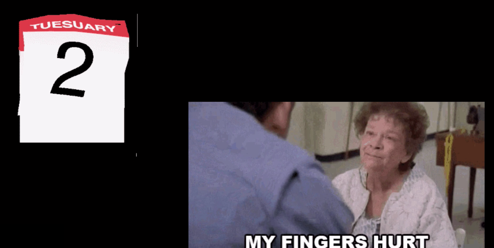

# Functions Part 1 - Creating and Calling Functions

- Imagine we have a robot that can run errands for us, like buying groceries

- We can give the robot commands on how to go to the grocery store

- We can tell the robot to buy us milk:

- And we can tell the robot to come back home:

- But if we had to tell these commands to the robot every day, we would get tired and then our fingers will hurt...

- What can we do instead? Well, what if we got all our code and packaged this into a single package of code, and you gave it a name?
- Well, this is what a function exactly is

- They allow you to creat a series of instructions:

- Package all these commands or lines of code
- The packaging is done by the opening and closing curly braces, which show where the series of instructions begins and ends
- In this case, the function's name is `getMilk`
- So the parts of a function are:
    - The `function` keyword
    - Name of the function (use camel case)
    - Parenthesis
    - Curly braces that contain all the instructions or commands

- Once you create the function above, getting our robot to go to the store and get our milk just takes calling the function (like pressing a button). And all the commands or lines of code in the function will execute or happen
- This saves us a lot of typing and repetition

- It's really important to know that there's a difference between creating a function and calling a function:

- See above:
    - Creating or declaring a function is when you give the function a name and codeblock (or set of commands)
    - When we want to _use_ the function, (a.k.a calling or invoking the function), then all you have to do is write the name of the function and the set of parenthesis

- As a person, we know that before we head out of our homes, we'll get dressed, put on our shoes, open the door, and lock the door
- But a robot or a computer doesn't know how to do any of that. It needs to be told what to do. It needs step-by-step instructions
- Notice that JavaScript functions _do not_ end with a semi-colon
- Try testing out the getMilk function in the Chrome Dev Tools or a repl.it
    - Replace the alerts with `console.log()`
- Difference between alert and console.log is that users will see alerts. But console.log is only for developers, not intended for users
- Console is used by developers to test out code