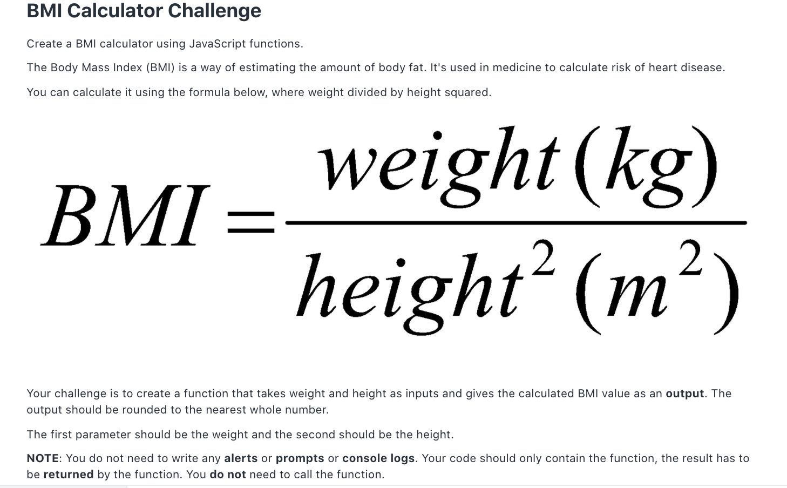

# Return Keyword + Challenge



- Solution:
```
function bmiCalculator(weight, height) {
    let bmi = weight / (height * height);
    return bmi;
}

console.log(bmiCalculator(95, 151));
```
- Also: 
```
function bmiCalculator(weight, height) {
    // see Math.pow() method on MDN docs
    let bmi = weight / Math.pow(height, 2);
    return bmi;
}

console.log(bmiCalculator(95, 151));
```
- Lastly:
```
function bmiCalculator(weight, height) {
    let bmi = weight / (height * height);

    // see Math.round() method on MDN docs
    return Math.round(bmi);
}

console.log(bmiCalculator(95, 151));
```